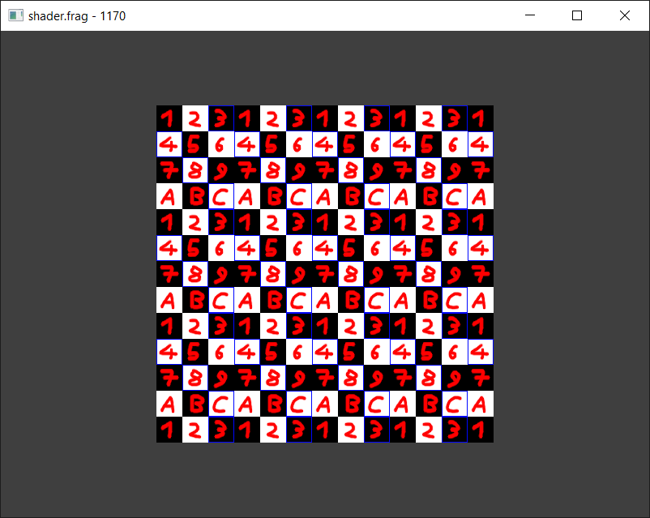

# SFML Shader Tilemap Example

Example of using a fragment shader and two textures (graphics and data) to draw a large tilemap in a single draw call.

`shader.frag` is the actual shader drawing the tilemap, `shaderx.frag`, `shaderxy.frag` and
`shadery.frag` show x, xz or y of the texture, to make it clearer how `shader.frag` works.

Graphicss load from `tilemap.png`, data texture is generated in C++.

Tile size is 32 (but can easily be changed by modifying shader and C++ both and doesn't have to be a power of two).

